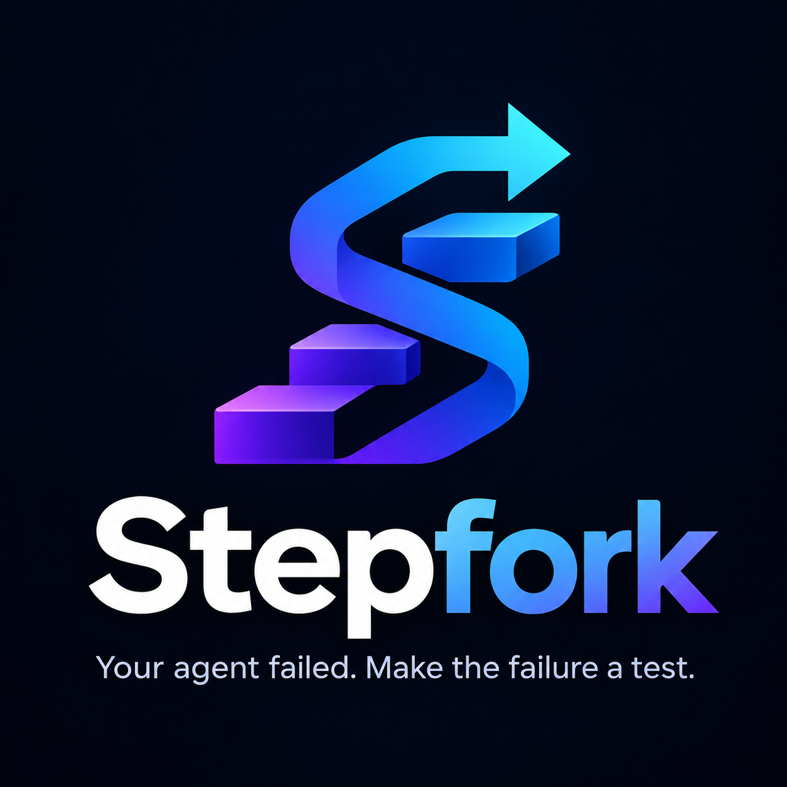

<p align="center">
  
</p>

<h1 align="center">Stepfork</h1>

<p align="center">
  <strong>Your agent failed. Make the failure a test.</strong>
</p>

<p align="center">
  Local-first behavioral regression testing for AI agents.
</p>

Product goal:

> Turn a failed AI-agent run into the smallest reproducible pytest regression
> test, locally, in under five minutes.

## Status

Stepfork is experimental. The API, CLI, and `.sftrace` trace format may change
before v1.0.

Stepfork includes typed `.sftrace` v0.1 models, directory storage, structural
validation, best-effort redaction, integrity verification, local inspection,
runtime recording, frozen replay, behavioral diffing, and executable pytest
export. Failure minimization, fork-at-step, and framework integrations remain
planned work.

## Installation

For local development:

```bash
uv sync
```

## Quickstart

Record an agent run and assert the behavior you expect after the fix:

```python
from stepfork import record, trace_tool, llm_request


@trace_tool(name="flight_search")
def search_flights(destination: str) -> dict:
    return flights_api.search(destination)


with record("booking-agent", output="failure.sftrace") as session:
    response = llm_request(
        model="demo-model",
        input={"messages": messages},
        call=lambda: client.chat(messages),
    )
    result = run_agent()
    session.set_output(result)
```

Then replay, compare, and export a regression test:

```bash
stepfork replay failure.sftrace --entrypoint mypkg.agent:run_agent --mode frozen
stepfork diff baseline.sftrace fixed.sftrace
stepfork export failure.sftrace --pytest \
  --entrypoint mypkg.agent:run_agent \
  --expect-output expected.json \
  --output test_regression.py --overwrite
```

The recorded failure is not the expected outcome. `--expect-output` supplies the
corrected behavior, so the generated test fails on the buggy agent and passes on
the fixed one.

Run the full end-to-end demo:

```bash
uv run python examples/booking_agent/demo.py
```

## CLI

```bash
stepfork validate demo.sftrace --verify-integrity
stepfork inspect demo.sftrace --json
stepfork replay demo.sftrace --entrypoint pkg.module:func --mode frozen
stepfork diff baseline.sftrace candidate.sftrace --json
stepfork export demo.sftrace --pytest --entrypoint pkg.module:func
```

## Documentation

- [Recording](docs/recording.md)
- [Replay](docs/replay.md)
- [Behavioral diff](docs/diff.md)
- [pytest export](docs/pytest-export.md)
- [Trace format](docs/trace-format.md)
- [Security notes](docs/security.md)
- [Architecture](docs/architecture.md)
- [Development](docs/development.md)

## Offline Trace API

```python
from stepfork import ToolCall, Trace

trace = Trace(agent_name="demo-agent")

event = trace.add(
    ToolCall(
        name="search",
        input={"query": "Kathmandu flights"},
    )
)

trace.save("demo.sftrace")
loaded = Trace.load("demo.sftrace")
```

Validate traces:

```bash
stepfork validate demo.sftrace --partial
stepfork validate demo.sftrace
stepfork validate demo.sftrace --verify-integrity
```

The `--partial` flag is required here because the example intentionally saves
only a `tool_call` event. Strict execution validation expects a complete trace
with a `run_start` event.

Inspect a saved trace locally:

```bash
stepfork inspect demo.sftrace
stepfork inspect demo.sftrace --json
stepfork inspect demo.sftrace --errors-only
```

## Integrity and Redaction

Stepfork applies best-effort redaction when saving `.sftrace` bundles. It
recursively redacts known sensitive keys such as `api_key`, `authorization`,
`password`, and common credential-looking strings before writing trace files.
Redaction metadata is stored in `redactions.json` without the original secret.

Persisted event payloads also receive SHA-256 hashes computed from Stepfork's
v0.1 canonical JSON profile after redaction. New bundles include an
`integrity.json` file with SHA-256 digests for `manifest.json`, `events.jsonl`,
and `redactions.json`.

Verify bundle integrity explicitly:

```bash
stepfork validate demo.sftrace --verify-integrity
```

Integrity status means:

- `verified`: the bundle's recorded file digests match the current files.
- `mismatch`: at least one recorded digest or payload hash does not match.
- `unverified_legacy`: the bundle predates `integrity.json`; it can still be
  structurally valid, but it has not been verified.

These checks are a release prerequisite, not proof that a trace is safe to
publish. Pattern-based redaction can miss sensitive information embedded in
unusual tool outputs, model responses, or domain-specific payloads. SHA-256 is
not encryption, and the unkeyed integrity file is not a digital signature. An
attacker who can modify both the trace files and `integrity.json` can rewrite
the record. Inspect traces carefully before sharing them.

## Workflow

```text
failed agent run
      ↓
record        capture tools, LLM calls, output, and failure
      ↓
inspect       review events, integrity, and error details
      ↓
frozen replay rerun the entrypoint without touching dependencies
      ↓
behavioral diff
      ↓
pytest regression test
```

## Roadmap

### v0.1

- Portable `.sftrace`
- Trace save/load
- Structural validation
- Best-effort redaction
- Integrity verification
- Validate CLI
- Inspect CLI
- Runtime recording
- Frozen replay
- Behavioral diff
- pytest export

### v0.2

- Failure minimization
- Fork-at-step
- Baselines

### v0.3

- LangGraph
- OpenAI Agents
- MCP
- GitHub Action
- Local viewer

## Development

Install dependencies:

```bash
uv sync
```

Run tests:

```bash
uv run pytest
```

Run linting and formatting checks:

```bash
uv run ruff check .
uv run ruff format --check .
```

Run static typing:

```bash
uv run mypy
```

Check the CLI:

```bash
uv run stepfork --help
```

## License

Stepfork is licensed under the Apache License, Version 2.0.
